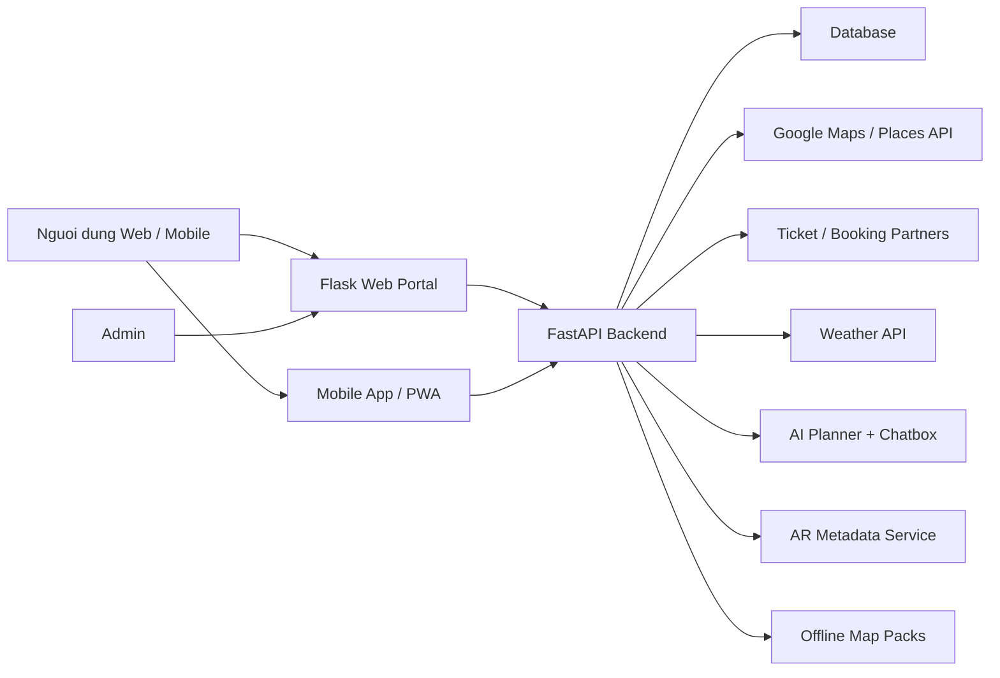

# Phan tich va thiet ke he thong

## 1. Ten de tai

Phan tich, thiet ke va xay dung ung dung huong dan du lich Viet Nam tren nen tang web va di dong su dung `Python FastAPI + Flask`.

## 2. Muc tieu he thong

He thong huong toi mot nen tang du lich thong minh, ho tro nguoi dung truoc, trong va sau chuyen di:

- Kham pha diem den noi tieng theo mien Bac, Trung, Nam.
- Tim dia diem theo dac trung: nui, hai dao, bien, tam linh, van hoa, lich su, am thuc.
- Len lo trinh AI, uoc tinh chi phi, quan ly chi tieu nhom.
- Tim nearby places theo vi tri hien tai: vui choi, an uong, khach san, nha thuoc, benh vien, sieu thi.
- Tich hop dat ve xe, tau hoa, may bay, khu vui choi.
- Ho tro da ngon ngu va chatbox 24/7.
- Phuc vu ca web portal, dashboard admin va ung dung di dong su dung chung API.

## 3. Doi tuong su dung

- Khach du lich trong nuoc.
- Khach quoc te can ho tro song ngu.
- Nhom ban, gia dinh can minh bach chi tieu.
- Quan tri vien cap nhat noi dung, theo doi truy cap va de xuat nang cap.

## 4. Phan ra chuc nang theo yeu cau de bai

| STT | Yeu cau | Cach dap ung trong thiet ke |
| --- | --- | --- |
| 1 | Hien thi thong tin diem du lich theo 3 mien | Bang `places`, loc theo `region`, giao dien `Flask` va API `FastAPI` |
| 2 | Phan loai theo dac trung | Truong `categories`, bo loc theo loai hinh |
| 3 | Tich hop mua ve | Module `Ticket Hub`, API doi tac dat ve |
| 4 | Goi y lo trinh AI | `AI Planner` sinh lich trinh theo so ngay, ngan sach, so thich |
| 5 | Goi y dia diem gan ban | GPS + Google Maps Places API + nearby service engine |
| 6 | Goi y must to go | Xep hang theo `must_go_score`, hien top dia diem dia phuong |
| 7 | Du toan chi phi | Budget engine + chia chi tieu theo nhom |
| 8 | Song ngu Anh - Viet | Bang ngon ngu, files giao dien va chatbot ho tro `vi/en` |
| 9 | Chatbox 24/7 | NLP/LLM + knowledge base du lich, thoi tiet, lo trinh |
| 10 | Giao dien dep, tone yeu cau | CSS theme sunrise + sky + lime + gold |
| 11 | Quan ly Admin | Dashboard, CRUD noi dung, thong ke truy cap, de xuat nang cap |
| 12 | Dashboard tong hop | KPI, top dia diem, settings, su dung lai cho admin |
| 13 | Dang ky/Dang nhap | Module auth, user session hoac JWT |
| 14 | Nhung Google Maps | Ban do, directions, nearby places, danh dau must-go |
| 15 | Du bao thoi tiet | Weather API theo diem den |
| 16 | AR | Quet di tich de hien 3D/model thong tin |
| 17 | Offline map | Tai truoc du lieu ban do cho vung song yeu |

## 5. Kien truc tong the

### 5.1 Lua chon cong nghe

- `FastAPI`: REST API nhanh, tai lieu Swagger tu dong, phu hop mobile/web.
- `Flask`: server-rendered web portal va dashboard admin nhe, de trinh bay do an.
- `SQLite/PostgreSQL`: luu du lieu dia diem, nguoi dung, chi tieu, booking.
- `Google Maps API`: directions, maps embed, nearby services.
- `Weather API`: du bao thoi tiet tai diem den.
- `AI service`: sinh lo trinh, chatbox tu nhien, de xuat must-go.
- `AR SDK`: co the dung `ARCore`, `ARKit`, `8th Wall`, `Vuforia`.

### 5.2 So do logic

### 5.3 Phan chia module

1. `User & Auth`
2. `Tourism Content`
3. `Search & Filter`
4. `AI Planner`
5. `Nearby Service`
6. `Ticket Hub`
7. `Budget & Group Expense`
8. `Chatbox 24/7`
9. `Weather`
10. `Admin Dashboard`
11. `AR & Offline Map`

## 6. Thiet ke chuc nang

### 6.1 Use case cho nguoi dung

- Dang ky, dang nhap.
- Xem dia diem theo mien va loai hinh.
- Xem diem must-go cua dia phuong.
- Nhap so ngay, ngan sach, so thich de nhan lo trinh AI.
- Tim nearby places quanh vi tri hien tai.